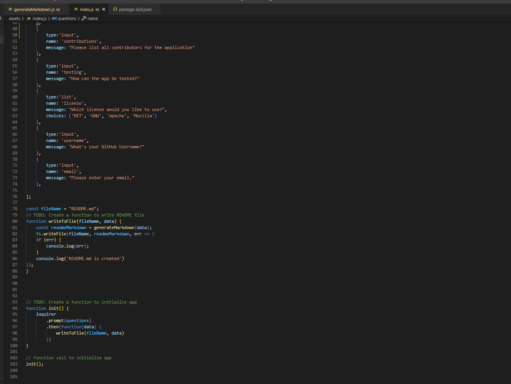
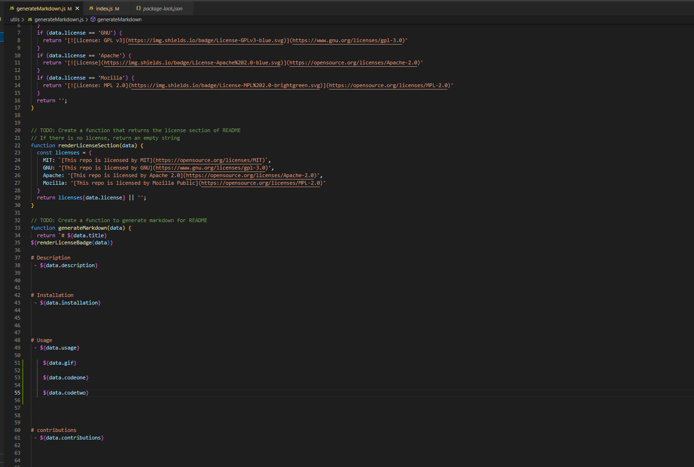

# README Generator

# Description
 - This application is a javascript application that is run through Node.js. When the application is ran through node you will be prompted on what you would like your readme to contain. When all the promts are answered the app will take the responses given and create a new readme file in the assets folder. When the readme is created it will appear in the correct format for a readme and can be used for any repository.
  
  ![]

# Installation
 - First i began to create my variables that im gonna use in the file. Next i added all the questions and what node will ask and take in. Then i created the function that creates/writes the readme file. After that i created the function that initialized/starts the questions/app and then called it. Next i created the function that generates the readme format on a different js file and exported it to call in the function to write the file. Then i created the function that loads the license badge that i used on the repo at the top of the readme. Finally i created a function that gives the link to the license details based off the selected option.

## Table of Contents
- [Installation](#installation)

- [Usage](#usage)

- [Contribution](#contribution)

- [Tests](#tests)

- [License](#liscense)

- [Questions](#questions)

# Usage
 - Please refer to the below gif -

  

  

  

# contributions
 - Sufyaan Vaidya

# Tests
 - Tests can be ran through Node.JS

# License
 - [This repo is licensed by MIT](https://opensource.org/licenses/MIT)

# Contact and Questions
 - Github: SufyaanVaidya
 - Email: vaidyasufyaan@gmail.com

